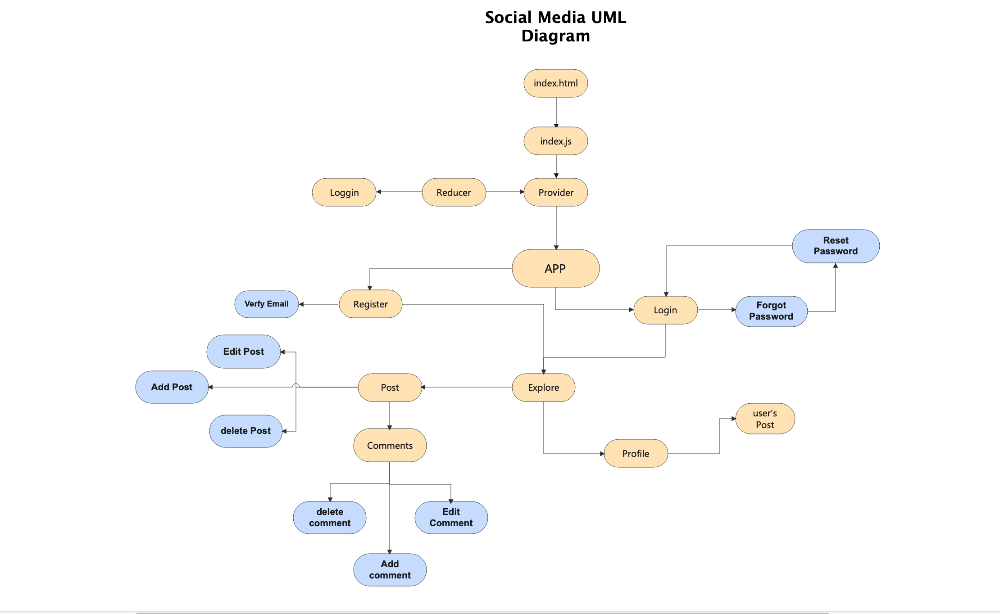

# Social Media (Meme Website)

#### Description 

A social Media App to share meme with others , countains a login and registration system, Builted with MongoDB , Express , React, Node js
and Redux .

# User Story 

* Register : user start the app with Sign Up to be able to navigate through the app
* login : User can share his meme  with others as long as he logged in 
* also user can login in the app by his Gmail account 
* get : tasks will display as a list when user login in the app . 
* Explore: user can see other's posts which called explore.

# React Router Routes 

| Path          | Component       |    Behavior       | 
| :---          |     :---:       |     :---:         |   
| /             |     Login       |  the start page   |    
| /signup       |     SignUp      |      Signup , navigate to the login |    
| /explore      |     Posts       |    posts page     |  
| /post         |     Post        |  posts , comments |    

# Components 

* Signup
* Login
* Verification
* Posts
* Post

# UML Diagram

# Technologies

* Mongoose
* Mongo DB
* express
* node js
* bcrybt
* jwt